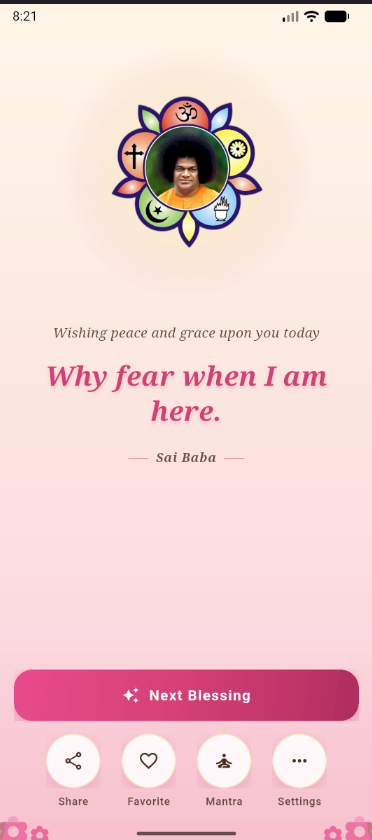
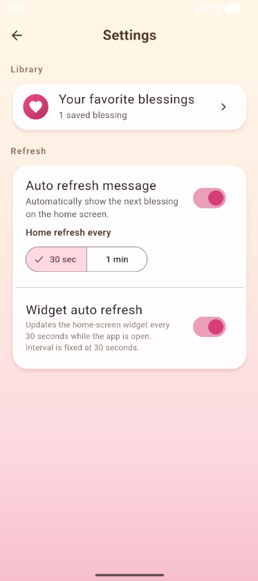

# SaiSays - Mobile Application

## 📱 Overview

Sai Ram everyone! Welcome to SaiSays, a mobile application created with devotion and care. This app brings together technology and spirituality to serve our community with love and dedication. Built with pure intentions and blessed guidance, SaiSays offers a meaningful digital experience that connects hearts and minds. We continuously share new messages and spiritual content to inspire and uplift our beloved community. This repository contains the blessed release with visual documentation for our beloved users.

## 🚀 Features

- Modern and intuitive user interface
- Smooth navigation and user experience
- Cross-platform compatibility
- Lightweight and fast performance

## 📸 Screenshots

The application interface and features are demonstrated in the following screenshots:

| Screenshot 1 | Screenshot 2 | Screenshot 3 |
|:------------:|:------------:|:------------:|
|  |  |  |

| Screenshot 4 | Screenshot 5 |
|:------------:|:------------:|
|  |  |

## 📦 Installation

### Android Installation

1. Download the APK file: `saisays-v1.0.0.apk`
2. Enable "Unknown Sources" in your Android device settings:
   - Go to Settings > Security > Unknown Sources
   - Toggle the switch to allow installation from unknown sources
3. Locate the downloaded APK file on your device
4. Tap on the APK file to begin installation
5. Follow the on-screen prompts to complete the installation

### System Requirements

- **Android**: 5.0 (API level 21) or higher
- **Storage**: Minimum 50MB free space
- **RAM**: 2GB or higher recommended

## 🔧 Usage

1. Launch the SaiSays application from your device's app drawer
2. Follow the on-screen instructions for initial setup
3. Explore the various features available in the application
4. Refer to the screenshots above for visual guidance

## 📋 Version Information

- **Current Version**: 1.0.0
- **Release Type**: Stable Release
- **File Size**: [Check APK file size]
- **Last Updated**: [Add release date]

## 🛠️ Technical Details

- **Platform**: Android
- **Architecture**: Universal APK
- **Target SDK**: [Add target SDK version]
- **Minimum SDK**: [Add minimum SDK version]

## 📞 Support

If you encounter any issues or have questions about the application:

1. Check the screenshots for visual guidance
2. Ensure your device meets the minimum system requirements
3. Try reinstalling the application if you experience any problems

## 🔒 Security & Privacy

- The application follows Android security best practices
- No sensitive data is stored without user consent
- All permissions requested are necessary for app functionality

## 📄 License

MIT License

Copyright (c) 2024 SaiSays

Permission is hereby granted, free of charge, to any person obtaining a copy
of this software and associated documentation files (the "Software"), to deal
in the Software without restriction, including without limitation the rights
to use, copy, modify, merge, publish, distribute, sublicense, and/or sell
copies of the Software, and to permit persons to whom the Software is
furnished to do so, subject to the following conditions:

The above copyright notice and this permission notice shall be included in all
copies or substantial portions of the Software.

THE SOFTWARE IS PROVIDED "AS IS", WITHOUT WARRANTY OF ANY KIND, EXPRESS OR
IMPLIED, INCLUDING BUT NOT LIMITED TO THE WARRANTIES OF MERCHANTABILITY,
FITNESS FOR A PARTICULAR PURPOSE AND NONINFRINGEMENT. IN NO EVENT SHALL THE
AUTHORS OR COPYRIGHT HOLDERS BE LIABLE FOR ANY CLAIM, DAMAGES OR OTHER
LIABILITY, WHETHER IN AN ACTION OF CONTRACT, TORT OR OTHERWISE, ARISING FROM,
OUT OF OR IN CONNECTION WITH THE SOFTWARE OR THE USE OR OTHER DEALINGS IN THE
SOFTWARE.

## 📝 Changelog

### Version 1.0.0
- Initial release
- Core functionality implemented
- User interface optimized for mobile devices

---

**Note**: This is a release version of the SaiSays application. For the latest updates and development versions, please check the main repository.
